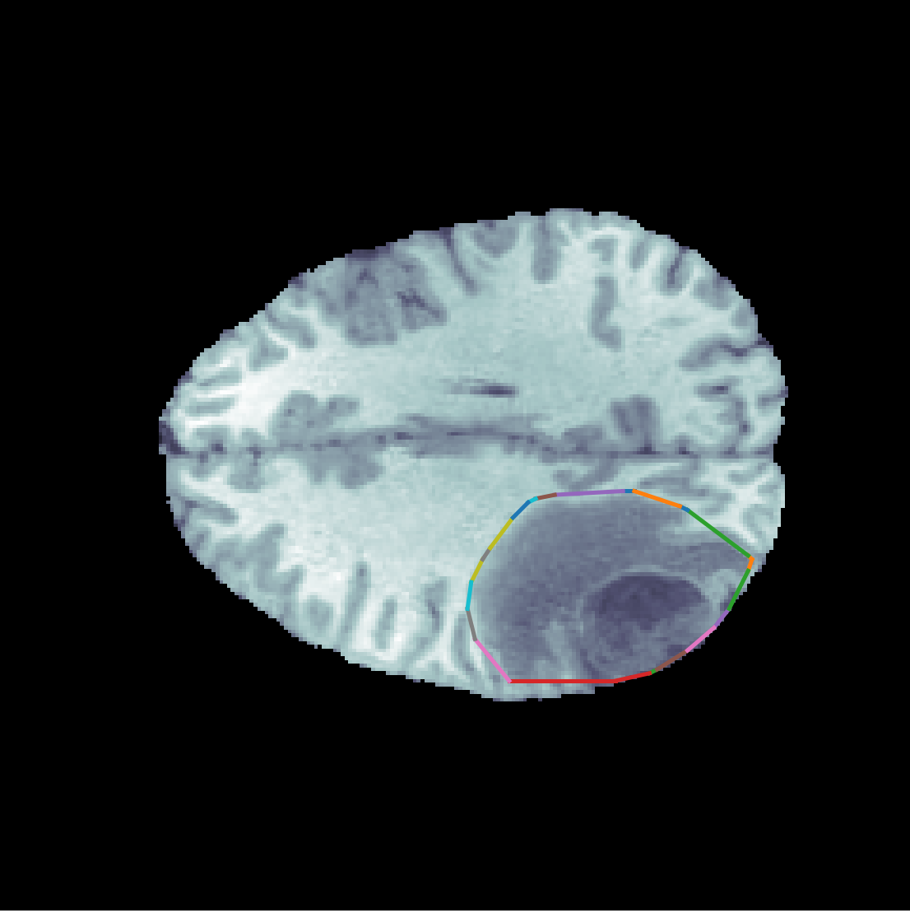
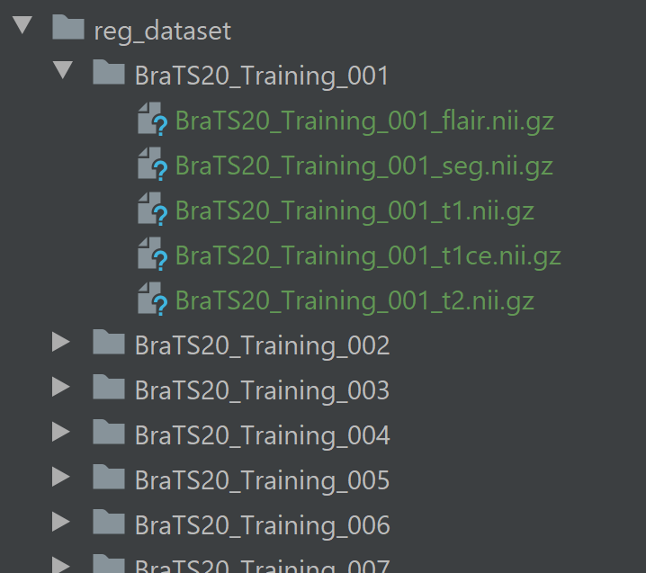

# Predicting Overall Survival in Patients with Glioma

Gliomas are the most common types of primary tumors which occur in the brain and spinal cord. Due to their rapid growth and aggressive nature, the survival rate of patients with this diagnosis is low. Having the capability of predicting the approximate survival days from MRI sequences can aid in treatment related decisions and in turn improve patient care. In this project, we develop a 3D Convolutional Neural network(CNN) and explore the performances of classical Machine Learning methods with handcrafted features for survival regression of patients with Glioma.

We touch upon both Deep Learning and Machine Learning Models to get a holistic idea about the problem space.

This repository includes a PyTorch 3D CNN model for GPU mode. It also includes Jupyter notebooks with some Classic Machine Learning Models trained on handcrafted features extracted from the available dataset.

## Dataset
The dataset comprising of 370 patients with MRI volumes from T1, T1ce, T2 and FLAIR modalities and survival information is made available by the Brain Tumor Segmentation (BraTS) Challenge 2020. Register at [http://braintumorsegmentation.org/](http://braintumorsegmentation.org/) to access the dataset. (PS: Approval to access data may take up to 3 days)

## Installations
 This project was developed on [PyTorch](https://pytorch.org/)  1.3.1 and Python 3.7.3. 

The following installations are needed to run the code.
 - **Nibabel** : Required for reading NIFTI files
`pip install nibabel`
 - **Tensorboard**: Required for visualization loss graphs
	 `pip install tensorboard`
	 
You can use [ImageJ](https://imagej.nih.gov/ij/download.html)  software to visualize the MRI sequence.

I recommend using [anaconda3](https://conda.io/docs/user-guide/install/download.html) to install any other dependency and [Pycharm](https://www.jetbrains.com/pycharm/) community version for code editing. 

## Instructions

 1. Download the dataset from [Brain Tumor Segmentation (BraTS) Challenge 2020](http://braintumorsegmentation.org/) and place it in the **reg_dataset** folder like this.
 
 2. Run `python src/data/data_generate.py` to create z-score standardized dataset that is automatically saved in the **normDataset** folder.
 3. Set DATASET_PATH = 'dummyDataset' in the **config.py** file and you can use **dummyDataset** to get the code running. It has MRI sequences of 5 patients.
 4. After training the model, you can open the Tensorboard dashboard and run the generated event files by running  `tensorboard --logdir ./runs/` and going to the URL it provides OR navigating to [http://localhost:6006/](http://localhost:6006/). 
 If you are running it on [Google Colaboratory](https://colab.research.google.com/notebooks/intro.ipynb), use the magic commands  `%load_ext tensorboard `
`%tensorboard --logdir ./runs/` to visualize the graphs.
 5. You can toggle some of the 'model toggle feature' flags in the **config.py** file to experiment with toggling age input, alternate MRI sequences, stacking MRI sequences etc.

## Usage
To train the model, run
`python main.py --mode=Train --epochs=50 --batch_size=32 --tb-prefix=testArchitecture --comment=addNewLayers --augmented=True
`

## Proposed Methods and Results
Take a look at the [Project report](SurvivalDaysReport.pdf) for data analysis,proposed methods, implementation details, visuals and results.

## Credits

 - Code structure inspired by [Deep Learning with PyTorch](https://www.manning.com/books/deep-learning-with-pytorch).
 - [Brain Tumor Segmentation (BraTS) Challenge 2020](http://braintumorsegmentation.org/) for the problem statement and publicly available dataset.
